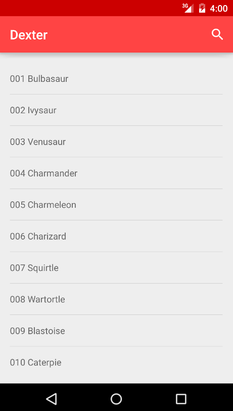
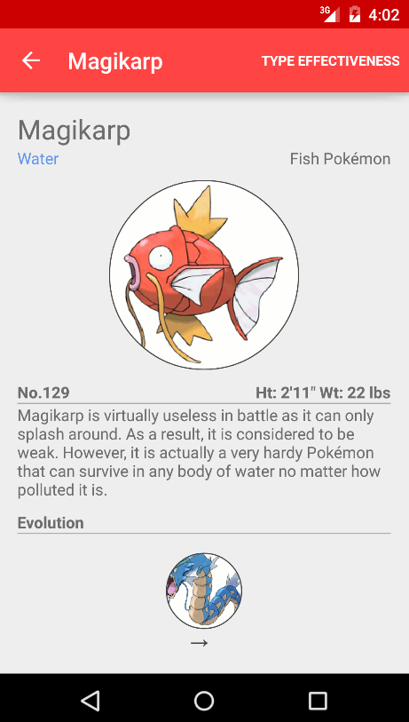
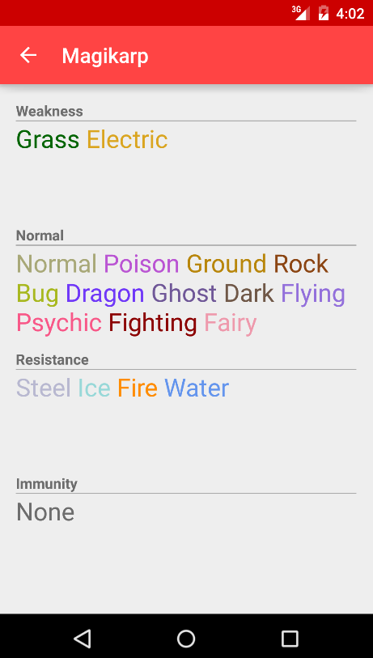

<h1>description</h1>
Android app that contains information regarding pocket monsters from the popular brand, Pokemon. 
THe database was created using python and scraping <a href="http://bulbapedia.bulbagarden.net/">Bulbapedia</a> for data. 
Images were also acquired from Bulbapedia. 

Screenshots: 

 
 

<h1>installation instructions</h1>
<em>This requires your phone to have at least Android 4.2 Jelly Bean (API level 17).</em> 
To use, download <a href="https://github.com/JotraN/dexter/raw/master/dexter.apk">dexter.apk</a> and install it onto your device. 
You can also build it yourself by importing the project into your preferred IDE. 

<h1>notes</h1>
Data collection was done in batches, some entries may have correct information. 
Please let me know which entries are incorrect, so I can update the database accordingly.  

Feel free to suggest any data or features to add to the application.
